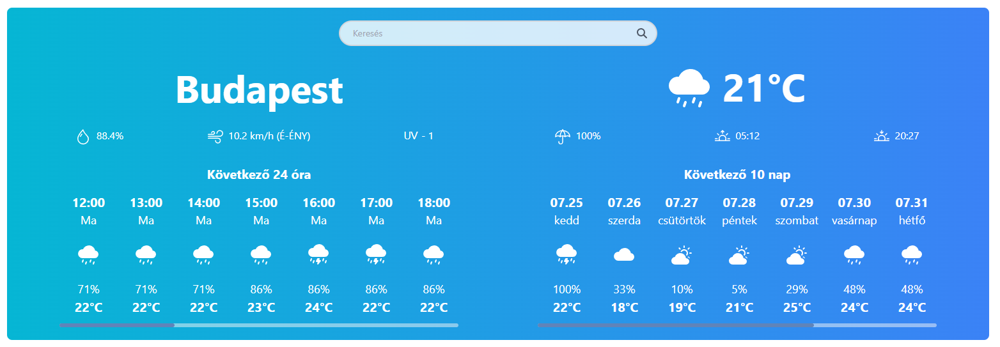
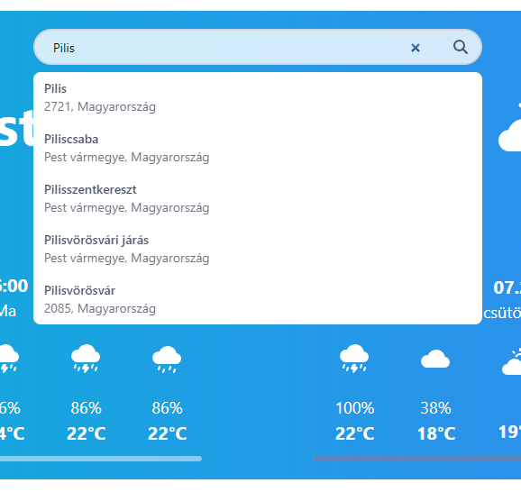

# React WeatherApp

## Leírás

Az alkalmazás megjeleníti az aktuális időjárás részletes adatait, illetve 24 órás óránkénti, és 10 napos előrejelzést is megjelenít.

### Megjelenített adatok (aktuális időjárás)

- Hőmérséklet
- Páratartalom
- Szélerősség és irány
- UV sugárzás szintje
- Eső valószínűsége
- Napkelte ideje
- Napnyugta ideje

### Megjelenített adatok (előrejelzés)

- Időpont
- Nap
- Várható időjárás (napos, felhős, esős, stb.) ikonja
- Eső valószínűsége
- Hőmérséklet

## Telepítés

Az alkalmazás telepítéséhez szükséges a [Node.js](https://nodejs.org/en/) telepítése.

Az alkalmazás letöltése után a következő parancsokat kell kiadni a mappában:

**Függőségek telepítése**

```bash
npm install
```

**Alkalmazás indítása**

```bash
npm run dev
```

## Használat

Az alkalmazást megnyitva alapértelmezetten Budapest időjárása jelenik meg.



A keresőmezőbe elég elkezdeni begépelni a kívánt város nevét, az automatikus kiegészítés segítségével a legördülő listából ki lehet választani a kívánt várost.



## Adatok

Az időjárási adatokat a [VisualCrossing](https://www.visualcrossing.com/weather-api) API szolgáltatja.

A városok automatikus kiegészítését a [Geoapify](https://www.geoapify.com/geocoding-api) API szolgáltatja.

## Felhasznált technológiák

- React
- Redux
- TailwindCSS
- Bootstrap icons